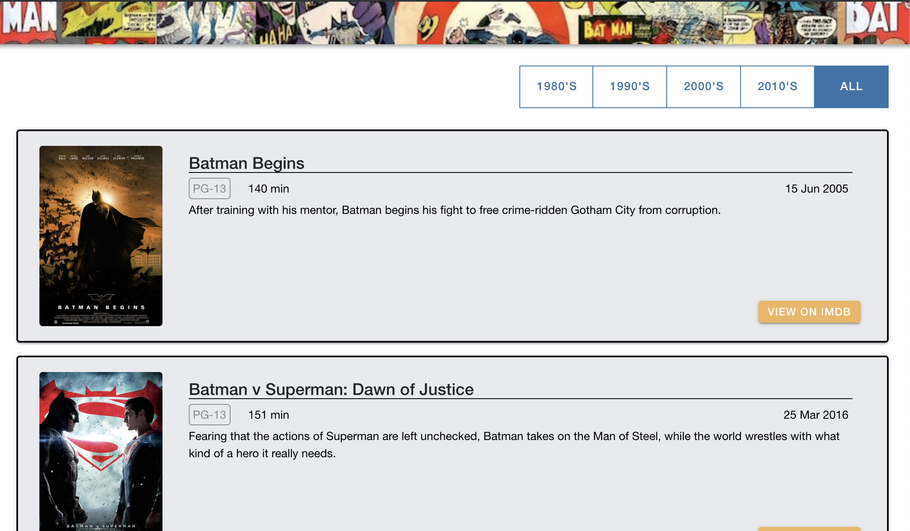

# BatmanMovies

### Installation
`npm install` install all the npm depecdencies, angular CLI should be declared globally, also this is using the Ionic CLI.
angular CLI should be install globablly 

### Running locally
`ng serve` or `ionic serve` will start the development application. Navigate to http://localhost:8100/.  

### Running unit tests
`ng test` will run the unit tests via Jest and Jasmine. 
Coverage report will be generated in coverage folder

### Running end-to-end tests
`ng e2e` will execute end to end tests using protractor

### Linting
`ng lint` will run linting for the ts files.  Rules can be setup in the tslint.json file.

### Applications 
This application is using
- Ionic 4 : https://ionicframework.com/docs/components
- Ionic 4 css utils: https://ionicframework.com/docs/layout/css-utilities
- Angular 7: https://angular.io/docs
- Jest:  https://jestjs.io/

### Using Angular/Ionic CLI
`ionic g <Schematic(optional)>` will help with generating 
- page
- component
- service
- module
- class
- directive
- gaurd

Angular CLI `ng g <Schematic>` 
- application
- class
- component
- directive
- e2e
- enum
- guard
- interface
- library
- module
- page
- pipe
- service